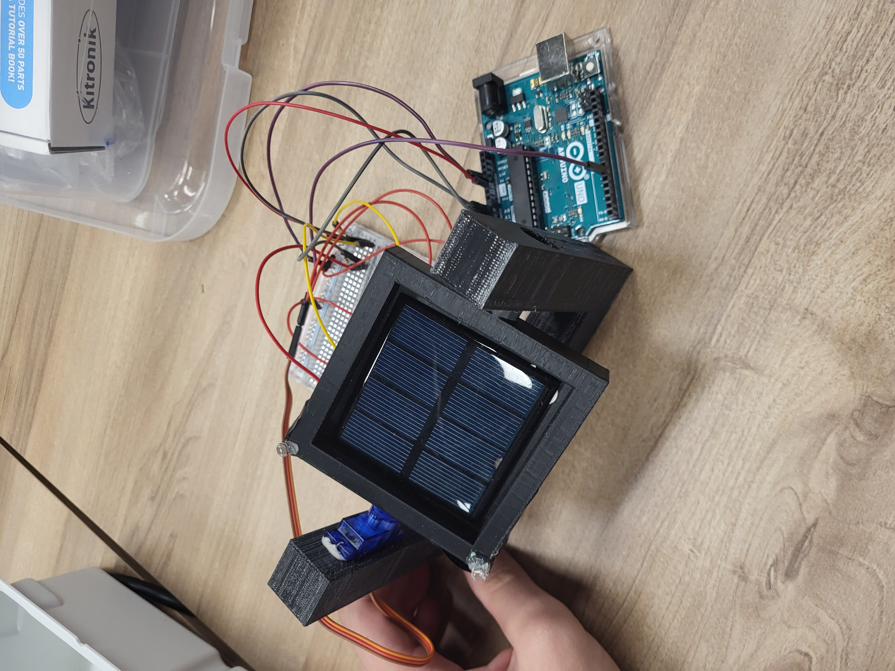

# Solar Tracker Project
(same as the report.odt)
## Table of Contents
1. [Project Overview](#project-overview)
2. [Materials and Components](#materials-and-components)
3. [System Design](#system-design)
   - [3.1 Sensor and Actuator Overview](#31-sensor-and-actuator-overview)
   - [3.2 Wiring Instructions](#32-wiring-instructions)
   - [3.3 Programming Guide](#33-programming-guide)
4. [Circuit Diagram](#circuit-diagram)
5. [Code Explanation](#code-explanation)
6. [Assembly](#assembly)
7. [Future Improvements](#future-improvements)
8. [Conclusion](#conclusion)
9. [References](#references)

---

## Project Overview

This project was part of my Year 12 Computer Science course to investigate control systems. I chose to design a solar tracker using an Arduino Uno to maximize light capture by aligning a solar panel with the sun as it moves.

Although the initial design included four photoresistors and two degrees of freedom, this implementation uses two photoresistors and a single servo motor, achieving one degree of freedom. This simplified version still demonstrates the core functionality of a solar tracker by rotating to follow the brightest light source in one axis.

## Materials and Components

- **Sensors**
  - 2 x Photoresistors (analog light sensors)
- **Actuator**
  - 1 x Micro Servo 9g (for rotation)
- **Connections**
  - Jumper Wires
  - Breadboard
  - USB A to barrel jack (for programming the Arduino)
- **3D printed parts**
  - `Solar_cell_holder.stl` (37cm³)
  - `Solar_bracket.stl` (100cm³)
- **Controller**
  - Arduino Uno
- **Resistors**
  - 2 x 10 KΩ resistors for voltage division
- **Power Supply Options (Choose based on portability needs)**
  - 9V Battery + Barrel Jack Adapter
  - 6 x AA Battery Pack (9V)
  - USB Power Bank (5V)
  - 12V DC Power Adapter for stationary setups
  

*Note: For testing, I powered the Arduino with a USB cable from my laptop.*

## System Design

### 3.1 Sensor and Actuator Overview
The photoresistors detect light intensity, with each sensor providing an analog voltage that correlates to the intensity of light hitting it (0-1024). This information is used to control the servo, which adjusts the angle of the tracker to align with the light source.

### 3.2 Characteristics of Sensors/Actuator
- **Photoresistor (Light Sensor)**
  - Type: Analog, passive
  - Signal: Analog voltage proportional to light intensity (range 0-1024 in Arduino’s 10-bits ADC)
  - Voltage Range: 0V to 5V
- **Micro Servo**
  - Type: Digital, active actuator
  - Signal: PWM (Pulse Width Modulation) to control angle
  - Voltage Range: 4.8V to 6V

### 3.3 Programming Guide
The code reads the photoresistor values, calculates their difference, and moves the servo to align with the light source. A threshold value is used to filter out noise, preventing constant oscillation due to minor fluctuations in light. (See [Future Improvements](#future-improvements) for more on noise handling.)

[GitHub Repository](https://github.com/philip344/solar_project/)

## Assembly
The assembly diagram below illustrates the positioning and connections of each component in the solar tracker. The labeled parts such as the solar panel, photoresistors, servo, and 3D-printed parts provide a clear reference for setting up the project.

## Circuit Diagram
A comprehensive circuit diagram is provided below to show the complete wiring for this project.

## Code Explanation

The program operates as a closed-loop proportional feedback control system. This is ideal for this project because it allows continuous adjustments based on real-time light data. This setup enables the solar tracker to actively align with changing light conditions, maximizing accuracy and responsiveness.
- **Threshold Control**: Minimizes small, unnecessary servo movements and oscillations.
- **Differential Reading**: Determines the side with more light and adjusts the servo to reduce the difference.
- **Servo Control**: Incremental movement ensures smooth tracking without overcorrecting.

## Future Improvements

- **Mechanical changes**:
  - *Addition of wire channels*: Adding internal wire channels to `Solar_cell_holder.stl` would prevent the photoresistor leads from tangling, resulting in a neater project.
  - *Attachment*: A stronger, more stable, yet impermanent attachment method to secure `Solar_cell_holder.stl` to `Solar_bracket.stl`.
  - *Prototyping board*: Using a prototyping PCB mounted on the back of `Solar_bracket.stl` instead of a breadboard would improve cable management. Male header pins could be pre-soldered into the prototyping board for modular connections.
- **Code changes**:
  - *PID Control*: Implementing a proportional-integral-derivative (PID) control algorithm for smoother adjustments and to factor in the constant differences in the photoresistors.
  - *Constant error correction*: With four photoresistors, cross-checking values could enable active error correction, improving accuracy.
  - *Granularity*: Improved threshold settings and more precise photoresistors (or an advanced noise filtering system) could allow for smoother movements.
- **System changes**:
  - *Control system*: While the Arduino Uno is excellent for prototyping, it is computational overkill for this project. An Arduino Nano or even a custom IC on a custom PCB could be more efficient and compact for the final design.
  - *Adding More Sensors*: Four photoresistors for two degrees of freedom, covering both vertical and horizontal planes.

## Conclusion

This solar tracker project successfully demonstrates a simple yet effective control system. With additional refinements, it has the potential to be a practical model. I was unable to complete the project to its fullest extent, as I realized midway through that less was required than initially planned, and the project would be more time-consuming than expected. Nevertheless, I thoroughly enjoyed working on this project and may revisit it in the future to explore further improvements and finish the design.

## References

- Arduino Documentation: [Arduino.cc](https://www.arduino.cc/)
- Servo Library Documentation: [Servo Library](https://www.arduino.cc/en/Reference/Servo)
- Fusion 360: [Fusion 360](https://www.autodesk.com/products/fusion-360/)
- Draw.io: [Draw.io](https://app.diagrams.net/)

*Philip Singer*
